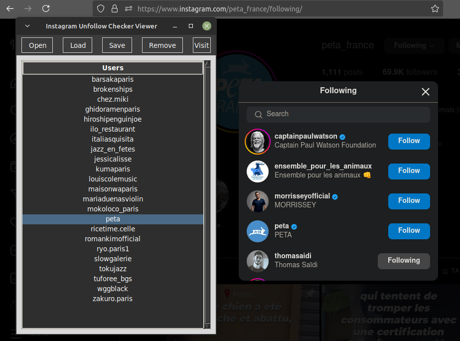

# Instagram Unfollow Checker

- This Python program checks for users who are not following you back on Instagram. It processes a ZIP file containing lists of your followers and the accounts you are following, and it outputs the usernames of those who do not follow you back.

- This method may take a long time to process, as you will need to wait for the Instagram data to be delivered to your account, but it does not require your credentials.

## Features

- Extracts followers and following lists from a ZIP file.
- Identifies users who are not following you back.
- Optionally saves the lists of followers, following, and unfollowers to text files.
- Supports case-insensitive username searches.

## Installation

1. Clone the repository or download the script.
2. Ensure you have Python 3 installed on your system.
3. Get your information in a ZIP file from your Instagram account

## Downloading your information from Accounts Center

To download a copy of your information from Instagram's Accounts Center, follow these steps:

1. **Navigate to Accounts Center**:
   - Click on **Accounts Center**.
   - Go to **Your information and permissions**.

2. **Download information**:
   - Click on **Download your information**.
   - Choose **Download or transfer information**.

3. **Select profiles**:
   - Select the profiles you want to download information from and click **Next**.

4. **Choose information amount**:
   - Specify how much information you wish to download and click **Next**.
   - You have to select at least `following and followers`.

5. **Select Download Method**:
   - **Transfer to Destination**: Choose a destination and schedule future transfers. You may need to sign in to the destination's app or website. Click **Start transfer** and enter your Instagram password.
   - **Download to Device**: Choose your file options, including:
     - Date range
     - Notification email
     - Download format
     - Quality of photos, videos, and other media.
   - Click **Create files** to finalize your request.
   - The ZIP file will be ready in a few hours. 

# CLI version

## Usage

Run the script from the command line as follows:

```bash
python3 checker.py <zipfile> [options]

# Or

./checker.py <zipfile> [options]
```

### Arguments

- `<zipfile>`: The path to the ZIP file containing the followers and following lists.
- `-v`, `--verbose`: Enable verbose mode to print additional information during execution.
- `-o`, `--outfile`: Save the followers, following, and unfollowers lists in `.txt` files.
- `-s`, `--search-username <username>`: Enable single username search to check if a specific user is following you.
- `-i`, `--case-insensitive`: Enable case-insensitive mode for username searches (only works with `-s`).

### Example

```bash
python3 checker.py instagram-myinstaname-2025-04-11-PoYF5GPn.zip -vo -s username -i
```

This command will:
- Process the ZIP file.
- Enable verbose output.
- Save the results to text files.
- Check if the specified `username` is following you, ignoring case.

## Output

- The script will print the usernames of users who are not following you back.
- If the `-o` option is used, it will save the following, followers, and unfollowers lists to:
  - `results/following.txt`
  - `results/followers.txt`
  - `results/unfollowers.txt`

---

# GUI version

Here's a sample README section for your GUI version of the Instagram Unfollow Checker. This section provides an overview of the application, its features, and instructions for usage.

## Overview

The **Insta Unfollow Checker Viewer** is a graphical user interface (GUI) application built with Python's Tkinter library. It allows users to easily manage and view their Instagram unfollowers by loading data from a ZIP file containing Instagram data or from a text file with usernames. The application provides a user-friendly interface to visualize and interact with the list of unfollowers.

## Features

- **Load Instagram Data**: Open a ZIP file containing your Instagram data to extract the list of unfollowers.
- **Load Usernames from File**: Import a list of usernames from a text file.
- **View Unfollowers**: Display the list of unfollowers in a scrollable table.
- **Remove Users**: Easily remove selected users from the list.
- **Visit Profiles**: Open selected Instagram profiles directly in your web browser.
- **Save List**: Save the current list of unfollowers to a text file for future reference.

## Installation
Run the application using the command:

```bash
python3 checker_viewer.py

# Or

./checker_viewer.py
```

## Usage

1. **Open ZIP File**: Click the "Open" button to select a ZIP file containing your Instagram data.
2. **Load Usernames**: Click the "Load" button to select a text file with usernames.
3. **View Unfollowers**: The unfollowers will be displayed in the table. You can scroll through the list.
4. **Remove Users**: Select a user and press the `Delete` key or click the "Remove" button to delete them from the list.
5. **Visit Profile**: Select a user and click the "Visit" button to open their Instagram profile in your web browser.
6. **Save List**: Click the "Save" button to save the current list of unfollowers to a text file named `unfollowers.txt`.

## Screenshot

